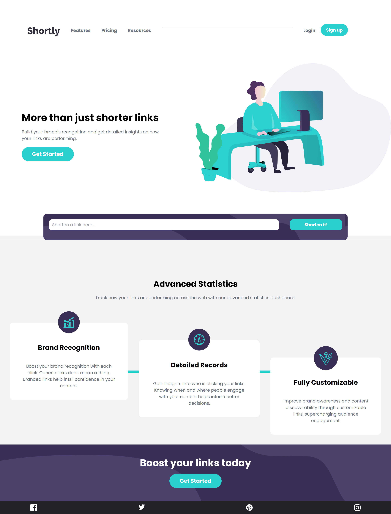
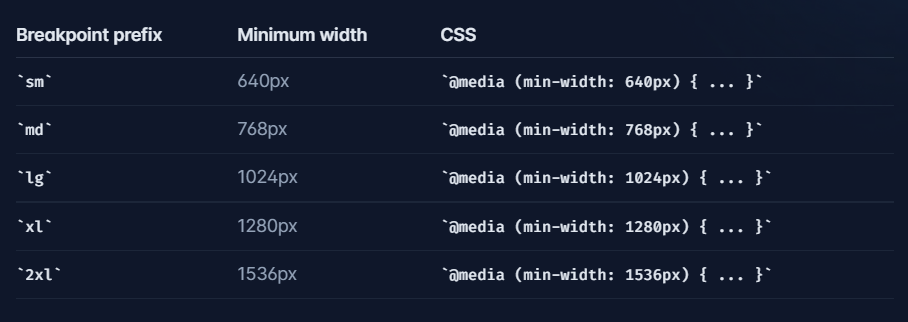
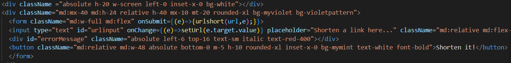

# Frontend Mentor - Shortly URL shortening API Challenge solution

이 솔루션은 [Shortly URL shortening API Challenge challenge on Frontend Mentor](https://www.frontendmentor.io/challenges/url-shortening-api-landing-page-2ce3ob-G) 챌린지 참여 결과물입니다.

## 차례

- [소개](#소개)
  - [챌린지](#챌린지)
  - [화면 스크린샷](#화면-스크린샷)
  - [링크](#링크)
- [배운 점](#배운-점)
  - [사용 tool](#사용-tool)
  - [새롭게 배운 것](#새롭게-배운-것)
  - [앞으로 배울 것](#앞으로-배울-것)
  - [참고 사이트](#참고-사이트)
- [제작자](#제작자)
- [기타사항](#기타사항)

## 소개

### 챌린지

url shortening api를 통한
url 줄이기 사이트를 제작했다.
tailwind css를 활용해 보았다.

### 화면-스크린샷




### 링크

- Solution URL: [Github](https://github.com/juurom/Searchbar___frontendMentor/)
- Live Site URL: [Live Site](https://juurom.github.io/Searchbar___frontendMentor/)

## 배운-점

### 사용-tool

- REACT
- tailwind css

### 새롭게-배운-것

js 기술적으로 어려운 건 따로 없었고... 새로 배운 tailwind css를 사용해 보았다. (짱쉽! 추천!)
tailwind css는 유틸리티 클래스를 잔뜩 모아둔 라이브러리이다.
유틸리티 클래스는 반복 사용되는 css를 하나의 클래스에 저장해 두고, 그 클래스를 여러 컴포넌트에 재사용하는 것이다.
([더 나은 설명은 여기에 - 코딩애플 tailwind css](https://www.youtube.com/watch?v=--D4WMPEIZI)) 


tailwind css의 대략적 사용법을 정리해 보았다.

1. height, width, margin, padding

매우 직관적이다. 대신 기본단위가 px이 아닌 rem이다.
* px과 rem 차이
px은 절대 단위. 브라우저를 확대/축소해도 변하지 않음
rem은 상대 단위. 브라우저를 확대/축소함에 따라 변화함
높이 10rem, 너비 12rem, margin 4rem, padding 5rem을 주고 싶으면 이렇게 입력하면 된다.
```jsx
<div className="h-10 r-12 m-4 p-5"></>
```
margin-left/right/top/bottom과 padding-left/right/top/bottom은 각 첫 글자만 따서 ml, mr, mt, mb / pl, pr, pt, pb로 작성하면 된다.
```jsx
<div className="ml-4 mr-5 pt-6 pb-7"></div>
```

2. color

rgb로 모든 값을 세세하게 정하지 않고도 [기본 제공 색상](https://tailwindcss.com/docs/background-color)을 이용할 수 있다.

background-color는 bg-colorname-weight로 작성하고, text-color는 text-colorneame-weight로 작성한다.
회색 배경에 흰 글씨를 쓰고 싶으면 이렇게 작성한다.
```jsx
<div className="bg-slate-500 text-white">HELLO WORLD!</div>
```

3. 확장
어 나는 기본제공된 스타일만 쓰기 싫은데?
하면 얼마든지 커스터마이징도 할 수 있다.
tailwind css를 설치하면 생기는 
tailwind.config.js 파일에 추가하면 된다.

기본 tailwind.config.js 는 이렇다.
```js
/** @type {import('tailwindcss').Config} */
module.exports = {
  content: [
    "./src/**/*.{js,jsx,ts,tsx}",
  ],
  theme: {
    extend: {},
  plugins: [],
}

```

요 extend와 plugins 자리에 추가하면 된다.
추가 방법은 필요할 때마다 tailwind css 홈페이지에서 확인하자.

나는 background color과 background image가 필요해서 이렇게 커스터마이징했다.
```js
/** @type {import('tailwindcss').Config} */
module.exports = {
  content: [
    "./src/**/*.{js,jsx,ts,tsx}",
  ],
  theme: {
    extend: {
      colors: {
        'mygray': '#bfbfbf',
        'mymint': '#2acfcf',
        'myviolet': '#3b3054',
        'mybggray': '#f2f1f3',
        'mydeepviolet': '#232127',
      },
      backgroundImage: {
        'violetpattern': "url('./images/bg-shorten-desktop.svg')",
      }, 
    },
  },
  plugins: [

  ],
}

```

4. 반응형

(제일 열받는 부분)
화면 너비에 따라 다른 css를 적용할 수 있다.

그런데 min-width 기준으로 작성된 것이라서
반드시 모바일 버전을 먼저 작성한 뒤에 데스크탑 버전을 오버라이딩 해야 한다.
화면 너비에 따라 길이가 변화하는 div은 이렇게 만든다.
화면 너비가 기본값으로 16rem, 768px 이상이면 32rem, 1024px 이상이면 48rem으로 변한다.

```jsx
<div className="w-16 md:w-32 lg:w-48"></div>
```

### 앞으로-배울-것

tailwind css 너무 편하다!!!

장점
1. 🐶쉬움. 하루 이틀 쓰면 금방 배워지는 것 같다.
2. css 파일 왔다갔다 안 해도 되는 게 너무 편하다.

단점
1. 코드 진짜 못생겨진다.
2. 반응형으로 하려면 두 배로 못생겨진다. 모바일 css를 먼저 작성하고 데스크탑 css를 오버라이딩해야 해서...

내 못생긴코드



### 참고-사이트

- [tailwidn css 공식 사이트](https://tailwindcss.com/)

## 제작자

- Github - [@juurom](https://github.com/juurom/)
- Frontend Mentor - [@juurom](https://www.frontendmentor.io/profile/juurom)

## 기타사항
js 난이도가 평이했다. 사실상 tailwind 연습용 프로젝트였던 듯. 좀더 어려워보이는 거 해봐야징